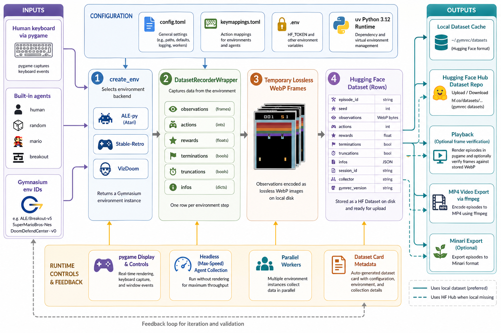

<div align="center">
  

  **🎮 Record and replay gameplay from Gymnasium environments as Hugging Face datasets 📊**
</div>

gymrec is a Python CLI for collecting gameplay from Gymnasium environments and saving it as replayable Hugging Face datasets. It supports human keyboard capture, built-in agent policies, local dataset storage, Hub uploads, playback verification, and MP4 exports.

It works across Atari through ALE-py, Stable-Retro console environments, and VizDoom. Recordings store observations, actions, rewards, episode metadata, collector provenance, and the gymrec version used to collect the run.

## Install

```bash
git clone https://github.com/tsilva/gymrec.git
cd gymrec
uv sync
cp .env.example .env
```

Add your Hugging Face token to `.env` when you want to upload datasets:

```bash
HF_TOKEN=your-api-token
```

Run the CLI from the repo root with `uv run gymrec ...` or `uv run python main.py ...`.

## Commands

```bash
uv run gymrec login                                      # authenticate with Hugging Face Hub
uv run gymrec list_environments                         # list Atari, Stable-Retro, and VizDoom envs

uv run gymrec record BreakoutNoFrameskip-v4             # record human gameplay
uv run gymrec record BreakoutNoFrameskip-v4 --dry-run   # save locally without upload prompt
uv run gymrec record SuperMarioBros-Nes --agent random --headless --episodes 100
uv run gymrec record BreakoutNoFrameskip-v4 --agent breakout --headless --episodes 50
uv run gymrec record BreakoutNoFrameskip-v4 --agent random --headless --episodes 100 --workers 5

uv run gymrec upload BreakoutNoFrameskip-v4             # upload new local episodes to Hub
uv run gymrec playback BreakoutNoFrameskip-v4           # replay recorded actions
uv run gymrec playback BreakoutNoFrameskip-v4 --verify  # compare replay frames against recorded frames

uv run gymrec video BreakoutNoFrameskip-v4              # export all episodes to MP4
uv run gymrec video BreakoutNoFrameskip-v4 --range 3-7  # export a 1-based episode range
uv run gymrec video BreakoutNoFrameskip-v4 --first 5
uv run gymrec video BreakoutNoFrameskip-v4 --last 5

uv run gymrec import_roms ./roms                        # import Stable-Retro ROMs
uv run gymrec minari-export BreakoutNoFrameskip-v4      # export local data to Minari format
```

## Usage

Human recording opens a pygame window. Press `Space` to start recording, use the environment-specific controls printed in the terminal, press `Tab` to toggle the overlay, use `+`/`-` to adjust FPS, and press `Esc` to stop.

Agent recording supports `human`, `random`, `mario`, and `breakout`. `--headless` is for agent mode only and requires `--episodes`; `--workers` runs parallel headless collection and cannot exceed the requested episode count.

Playback uses the local dataset first, then falls back to the Hugging Face Hub dataset repo. Video export requires `ffmpeg` and writes MP4 files from local data or downloaded Hub data.

## Notes

- Requires Python `>=3.12,<3.13` and `uv`.
- Hugging Face uploads use dataset repos named `{username}/gymrec__{encoded_env_id}` by default.
- Local datasets are stored under `~/.gymrec/datasets` by default.
- `config.toml` controls display scale, FPS defaults, local storage, dataset metadata, and overlay defaults.
- `keymappings.toml` controls Atari, VizDoom, and Stable-Retro keyboard bindings.
- On Apple Silicon, `uv sync` installs the committed native Stable-Retro wheel through the project configuration.
- `ffmpeg` must be available on `PATH` for `video` exports.
- `minari-export` requires Minari; install it with `uv sync --extra minari` or `uv pip install 'minari>=0.5.0'`.

## Architecture



## License

[MIT](LICENSE)
